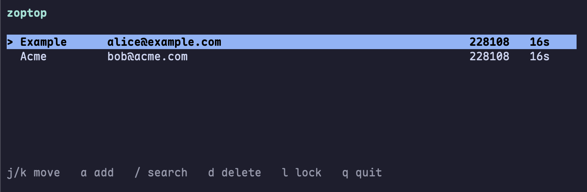

# zoptop

A Time-based one-time password (TOTP) library and TUI app.



## Usage

Clone the repository and build the app. Requires Zig.

```
git clone https://github.com/braheezy/zoptop
cd zoptop
zig build
./zig/out/zoptop
```

Add accounts by provding an otp auth URI

```
otpauth://totp/Acme:account?secret=JBSWY3DPEHPK3PXP
```

The encrypted data file it creates will be in `~/.config/zoptop` or `~/.zoptop` or in the current directory, in that priority order.
